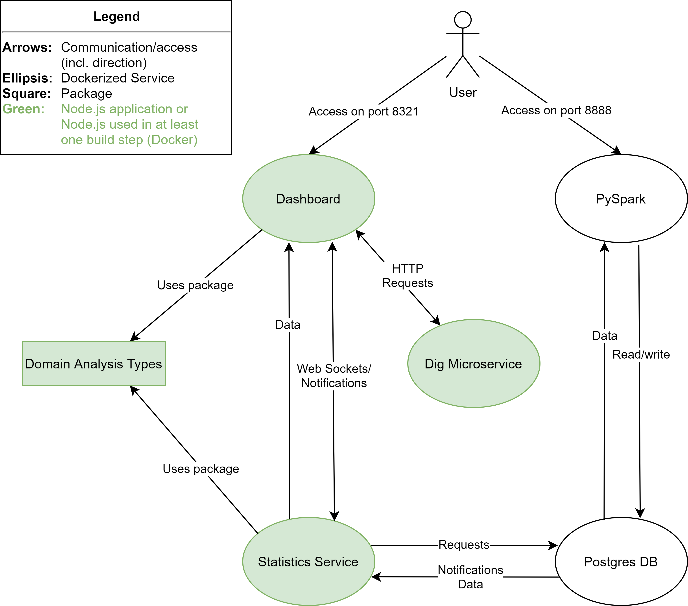

# Domain Analysis - Group 04 - Big Data Analytics, HTW Berlin

This is a monorepo containing both the source files (LaTeX) of a [conceptual documentation](./conceptual-doc/README.md)
and of the [domain analysis](./src) itself.

## Repository Structure

The repository is structured as follows (all directories that are under version control are linked to their respective README):

- [.github (GitHub Workflows)](./.github) (see section below)
- [conceptual-doc (Conceptual Documentation)](./conceptual-doc/README.md)
- data (not under version control)
- [src (Source Code for services and package(s))](./src/README.md)

## License

The project is licensed as Attribution-NonCommercial 4.0 International (CC-BY-NC-4.0). If you are not familiar with this
license, read more about it [here](https://creativecommons.org/licenses/by-nc/4.0/).

## Workflow

This project has one [CI pipeline](./.github/workflows/assignment-zip-artifact.yml) for creating an artifact containing:

- The repository as `zip`
- The LaTeX documentation as `pdf`
- The presentation converted to `pdf`

All files are renamed including the current date. The pipeline  is triggered on each push to `master`.


## Prerequisites

### Docker

In order to start this project, you will need:

- [Docker](https://www.docker.com/)
- [docker-compose](https://docs.docker.com/compose/install/)

For development, all required tools are listed in the respective sub-projects' READMEs.

### Files

You will need a few files that are not under version control for **legal reasons**, i.e.:

- Parsed domain data (to be stored in `./data/real_domains.csv`) (This directory will be mounted to the PySpark
  container, read more [here](./src/services/pyspark/README.md))
- [Postgres Driver 42.2.22](https://jdbc.postgresql.org/download/postgresql-42.2.22.jar) to be stored
  in [./src/services/pyspark](./src/services/pyspark) (Read more about it [here](./src/services/pyspark/README.md))
- GeoLite2 Database files, both to be stored in [./src/services/pyspark](./src/services/pyspark) (Please insert your own
  token in the URLs listed below / Read more about it [here](./src/services/pyspark/README.md)):
    - https://download.maxmind.com/app/geoip_download?edition_id=GeoLite2-ASN&license_key=YOUR_LICENSE_KEY&suffix=tar.gz
    - https://download.maxmind.com/app/geoip_download?edition_id=GeoLite2-City&license_key=YOUR_LICENSE_KEY&suffix=tar.gz

__Don't worry.__ The next section will show you the easiest way to set up the project locally.

## Set up this project

### The easiest way: All-in-one bash script

In order to make this tool as easily usable as possible, there is a bash script for

- Managing the required `csv` data
- Checking if files to be manually downloaded exist (see [here](./src/services/pyspark/README.md))
- Starting all services (`docker-compose`)

This setup script can be found [here (setup.sh)](./setup.sh).

It will throw an error if required data is missing and only start the containers once every requirement is met. If
something is missing, there will be valuable output concerning how to fix the problem. Below, it will be discussed how
this script can be called.

_**Note:** the `bash` command can only be run in a Linux-based terminal. However, if you are using Windows, you can use
your Git Bash._

#### Called without param

```shell
bash setup.sh
```

In this case, it is obligatory to have stored the required data in `./data` already (e.g. by having run the command
presented below some time before).

#### Called with file path

```shell
bash setup.sh absoulte/path/to/your/downloaded/file/data.csv
```

In this case, after checking whether the file (its name is not important) exists and whether it is a `.csv` file, it
will be copied to the required location (`./data/real_domains.csv`). If a file already exists, it will be overwritten.
Once you have imported the data, this command is no longer necessary, i.e. the file path can be excluded from the
command (see above).

#### Called from any location

In the examples above, the commands were intended to be run from the root directory. However, you can also call it from
anywhere else:

```shell
bash path/to/your/repo/setup.sh 
bash path/to/your/repo/setup.sh absolute/path/to/your/downloaded/file/data.csv
```

### Manual verification and execution of commands

After verifying whether the required data exists, the bash script does nothing else than (
in [./src/services](./src/services)):

```shell
docker-compose -p "bda-gr4-domain-analysis" up -d
```

Of course, in order to set up the services, and a network through which they are interacting, you can run the command
above (in [./src/services](./src/services)), too. Just make sure the required data is existing. The `-d` flag is used in
order to run in detached mode, but not necessarily required. The flag `-p <name>` is not required either but recommended
as it is a descriptive project name.

However, as it requires manual verification of whether the domain data to be analyzed exists (`./data/real_domains.csv`), we do not **recommend this approach** and suggest the bash script.

## Shut down this project

### The easiest way: All-in-one bash script

Similarly to the setup script, there is also a [shutdown script (shutdown.sh)](shutdown.sh) we recommend to use.

It stops the docker-compose and can be called with the following optional arguments:

- `rmdata` &rarr; removes the stored `csv` data
- `rmi` &rarr; removes all built images
- `rmdb` &rarr; removes the mounted Postgres storage (Read more [here](./src/services/README.md))
- `rmpgjar` &rarr; removes the downloaded Postgres driver (Read more [here](./src/services/pyspark/README.md))
- `rmgeodb` &rarr; removes the downloaded GeoLite2 Database files (Read more [here](./src/services/pyspark/README.md))

Example for shutting down:

```shell
bash shutdown.sh
```

Example for shutting down with optional arguments (here: for removing images and data)

```shell
bash shutdown.sh rmi rmdata
```

### Manually

Again, the project can also be shut down manually.

In order to shut down the services and remove their containers/network, navigate to [./src/services](./src/services) and run:

```shell
docker-compose -p "bda-gr4-domain-analysis" down
```

Please note that you have to state the same name as `-p <name>` as when started (see above). For more `docker-compose`
commands, have a look at
the [Docker Documentation (docker-compose)](https://docs.docker.com/engine/reference/commandline/compose/).

Data has to be deleted manually in your file system.

In order to remove images, you can run:

```shell
docker rmi <image name>
```

Again, we strongly recommend the shutdown script.

## Access containers

Once everything is running, you can access:

- `8888`: [PySpark](./src/services/pyspark/README.md) (Token: `token4711`, notebooks in: `work/notebooks`)
- `8321`: [Dashboard](./src/services/dashboard/README.md)

Learn more about the containers and how they are interacting [here](./src/services/README.md).


## Simple figure visualizing the architecture


