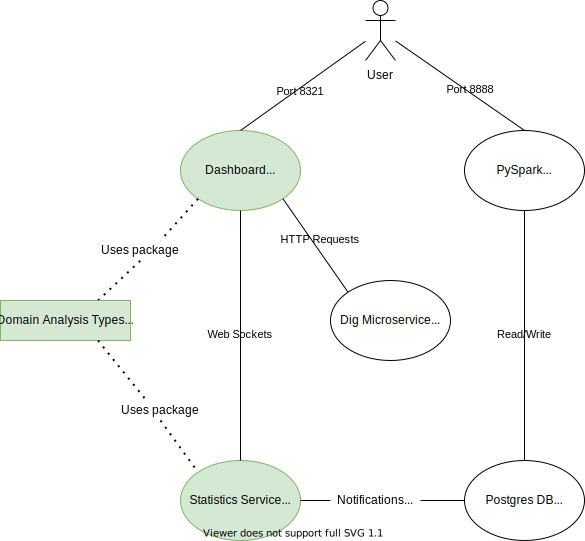

# Services

This directory contains the source code for all services to be dockerized, i.e. each subdirectory contains
a `Dockerfile` referenced to from [this directory's compose file](./docker-compose.yml). The services themselves can also
be own projects ([dashboard](./dashboard), [dig-microservice](./dig-microservice), [statistics-service](./statistics-service)).

## Docker Network

The containers are communicating through a custom network, i.e. only the required ports are accessible from your machine:

- `8888`: [PySpark](./pyspark/README.md) (Token: `token4711`, notebooks in: `work/notebooks`)
- `8321`: [Dashboard](./dashboard/README.md)

## Volume Mounting

Also, docker-compose manages the mounted volumes, i.e.:

- [Postgres](./postgres-db/README.md):
    - Database data (git ignored)
- [PySpark](./pyspark/README.md)
    - the repository root's `data` directory (git ignored) (read more about it in the [root README](../../README.md))
    - [Notebooks](./pyspark/notebooks)
    - [Notebook README](./pyspark/README.ipynb)

## Simple diagram visualizing the architecture

